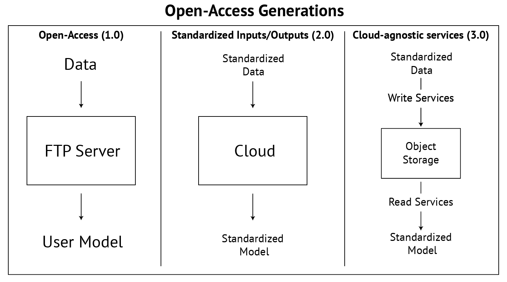

---
date:
  created: 2024-12-22
  updated: 2024-12-28
authors:
  - taddyb
---

# The Technical side of AGU 2024: What happened and where are we going

Two weeks ago, the American Geophysical Union (AGU) hosted its annual fall meeting in Washington, D.C., with [over 25,000 attendees from 100+ countries](https://www.ncei.noaa.gov/news/agu2024#:~:text=In%20keeping%20with%20the%20theme,Earth%20and%20space%20sciences%20community) present to share their research. For those reading who have not been, nor heard of AGU, there are four major themes present:
- Earth's subsurface
- Earth's surface
- The atmosphere
- Space

With several [sections](https://www.agu.org/learn-about-agu/about-agu/governance/sections) spread across the disciplines. Within each section there are many sessions corresponding to a research topic proposed by a group of scientists. Generally, most scientists submit one abstract to their field of study, and rarely, a second to a different section. At the conference research conversations occurred at posters, sessions, and oddly timed coffee hours during the lulls in programming (had to get my yearly zinger at AGU's coffee policy). Now that my brain, and feet from the 20,000 daily steps, have recovered, I want to write about my most significant takeaway from the week and where I predict things will be headed next year. 

<!-- more -->

##### Author's Note:

For context on my research at the conference, I spent the majority of my week attending sessions in the Atomospheric Sciences, Hydrology, Informatics, and Natural Hazards sections as my work/research involves hydrologic-focused machine learning methods and river routing (spending 80% of my time in Hydrology). I had two eLightning talks about [representing reservoirs within a differentiable muskingum-cunge river routing model](https://agu.confex.com/agu/agu24/meetingapp.cgi/Paper/1705938), and the [Replace and Route NOAA-OWP application](https://agu.confex.com/agu/agu24/meetingapp.cgi/Paper/1699282).

## Welcome to Open-Access 3.0

My big takeaway was not that AI would be taking [our jobs](https://x.com/ThePrimeagen/status/1870267800230441104) or that there was a new "state-of-the-art" model but that we're entering the next generation of data sharing for model inputs or validation. I don't mean the open access of the final research writeups such as [open access journals](https://www.agu.org/-/media/Files/Publications/WRR_FullyOpenAccess_FAQ.pdf), which is a topic of another blog post, but instead the tools, and services, used to access data from high impact papers to allow for one to reproduce results and/or building on top of existing literature. To put it in a metaphor, if a new research paper is a car, researchers don't want to see the showroom model but would rather pop the hood, understand the engine, and see what parts are upgrades from what they already have. 

  
   
  <em>Figure 1: Evolution of Open-Access generations showing the progression from basic data sharing to standardized formats, and finally to cloud-optimized real-time access.</em>

## Why call it Open-Access 3.0?

Similar to Web 1.0, 2.0, and 3.0 ideas, you can label versioning on an idea to indicate substantial jumps in the goals/roadmap. 

##### Reflection on Open-Access 1.0

The first generation of Open-Access brought about achievements such as the CAMELS dataset (Newman et al. 2014) and even Google Earth Engine (GEE) (Gorelick et al. 2017) for providing services to subset spatial rasters. However, while the first generation of open-access science was predicated on data and code availability, there were flaws to the idea as there was not a universal standard for putting Data online with two exceptions: 1) There was a license for terms of usage, and 2) There would be some instructions on how to use the data to your benefit. While science has benefitted from this practice, it became apparent that these two requirements were not enough to pass on valuable research as one would need to download the code via FTP (either through a website download link or via Google Drive, Microsoft OneDrive, Box, etc.), understand the naming conventions around the variable names and units, and build code to ingest the data and sample into their model. This process could need to be replicated for each data source, creating overhead costs for collaboration. 

##### Reflection on Open-Access 2.0

Thus, the next generation of open-access (2.0) intended to solve these problems by standardizing data structures and datasets. An example of dataset standardization is the FAIR guiding principles for scientific data management to improve the Findability, Accessibility, Interoperability, and Reuse of digital assets (Wilkinson et al. 2016). Similar efforts were adopted in 2013 and again in 2020 to bring standards to model inputs/outputs through the Community Surface Dynamics Modeling System (CSDMS) Basic Modeling interface (BMI) (Peckham et al. 2013; Hutton et al. 2020). Recently, data structures have experienced standardizations such as the [Python Array API](https://data-apis.org/array-api/latest/#) and the Numpy (Harris et al. 2020) Array API to ensure the countless packages for scientific Python computing can be interoperable. While the increase in specifications helped reduce the time the user needs to take to understand the metadata/contents of a data repo and tools required for sampling the data, there was still two problems 1) Latency of downloads from Data hosting websites, and 2) speed/memory constraints with sampling methods (Even GEE, the most scalable of all Open-Access applications, has a page on [coding best practices](https://developers.google.com/earth-engine/guides/best_practices) as certain operations can cause your runtime/compute to drastically increase). 

##### Now the description of Open-Access 3.0

Thus, Open-Access 3.0  has the mission to develop near-real-time read/writes of scalable cloud observation, model, and research data in a manner that is accessible to all scientists. 

## So, how did presentations at AGU support Open-Access 3.0?

While I believe I'm the first person to develop a semantic naming structure to describe the evolution of internet data availability in scientists (and if I'm not, feel free to let me know in the GitHub PR), I'm not the first person to recognize this trend. On Thursday, Joe Hamman of Earthmover gave an invited talk on his company's vision of "Seamless Arrays"—the ability to easily query a data cube across spatial and temporal dimensions with low latency (Hamman et al. 2024). Some of the poster sessions focused on Open-Access 3.0 included work detailing toolboxes for watershed modeling (Rébillout et al. 2024), methods for distributing array operations in a serverless fashion (White et al. 2024), and tools for retrieving files from an ID entry within a shared cloud registry (https://github.com/heliocloud-data/cloudcatalog). NOAA National Water Model (NWM) sessions included work detailing designing and implementing a BigQuery dataset and API for the NWM (Markert et al. 2024). Other works under the theme of open-access 3.0 include a poster on earth system modeling and benchmarking for CMIP6 data (Lee et al. 2024), and a talk on the icepyx software for querying ICESat-2 data.

## There are a lot of similar ideas... Where will this be going in 2025? Should I get in on Open-Access 3.0?

Given the past as a predictor of the future, I believe Open-Access 3.0 likely mirrors patterns we've seen in developer tools before. Consider the history of IDEs: while many groundbreaking early applications [no longer exist](https://medium.com/@jankammerath/revolutionary-ides-that-shaped-software-development-de45cbb408fe), but their innovations laid the foundation for modern development environments. Some of the novel projects that exist today, like VIM and NeoVIM, were once the same project, but diverged at core points and now exist separatly using different roadmaps. The projects often pull inspiration from one another, but are different entities. At its core, Open-Access 3.0 is straightforward: distributed reads and writes around cloud-optimized datasets. However, as we saw at AGU this year, this simple idea can become complex when datasets expand across spatial and temporal dimensions and increase in parameter count. Just as the IDE landscape eventually settled into a few dominant platforms while maintaining room for specialized tools, I believe Open-Access 3.0 will follow suit. Some platforms may emerge as standards, particularly for specific scientific domains or data types. However, the diversity of scientific computing needs means there will always be value in creating new approaches. If existing tools don't align with your research requirements—whether it's for watershed modeling, ICESat-2 data querying, or machine learning I/O optimization—the field needs your contribution. So dust off that keyboard and get working! AGU25 abstracts are due in 8 months!

## My prediction for next year

Looking ahead to AGU 2025, I hope to see these tools mature and new methods emerge, particularly at the intersection of read/write services and machine learning. Machine learning samplers are built to handle big data. However, this data is often locally hosted rather than pulled from object storage in the cloud. I believe sampling directly through the object stores NOAA is putting together through their big data project on AWS (Simonson et al. 2022; Willett et al. 2023) and other publically available global data such as Caravan (Kratzert et al. 2023) on GCP will unlock the ability to use larger-scale models if scientists don't have access to high-powered computing. Further, given there is a push for openly sharing model [checkpoint weights](https://groups.google.com/g/neuralgcm-announce/c/Fyjs-L1ORiM), I predict the combination of data-availability, and trained models, will usher in a surge of abstracts and funding for ML ventures.

## References:

A. Newman; K. Sampson; M. P. Clark; A. Bock; R. J. Viger; D. Blodgett, 2014. A large-sample watershed-scale hydrometeorological dataset for the contiguous USA. Boulder, CO: UCAR/NCAR. https://dx.doi.org/10.5065/D6MW2F4D

Gorelick N, Hancher M, Dixon M, Ilyushchenko S, Thau D, Moore R. 2017. Google Earth Engine: Planetary-scale geospatial analysis for everyone. Remote Sensing of Environment. 202:18–27. doi:10/gddm6z.

Hamman J, Abernathey RP, Cherian D. 2024. Seamless Arrays: A Full Stack, Cloud-Native Architecture for Fast, Scalable Data Access. AGU24.

Harris, C. R., Millman, K. J., J., S., Gommers, R., Virtanen, P., Cournapeau, D., Wieser, E., Taylor, J., Berg, S., Smith, N. J., Kern, R., Picus, M., Hoyer, S., Van Kerkwijk, M. H., Brett, M., Haldane, A., Del Río, J. F., Wiebe, M., Peterson, P., . . .  Oliphant, T. E. (2020). Array programming with NumPy. Nature, 585(7825), 357-362. https://doi.org/10.1038/s41586-020-2649-2

Hutton et al., (2020). The Basic Model Interface 2.0: A standard interface for coupling numerical models in the geosciences. Journal of Open Source Software, 5(51), 2317, https://doi.org/10.21105/joss.02317

Kratzert F, Nearing G, Addor N, Erickson T, Gauch M, Gilon O, Gudmundsson L, Hassidim A, Klotz D, Nevo S, et al. 2023. Caravan - A global community dataset for large-sample hydrology. Sci Data. 10(1):61. doi:10.1038/s41597-023-01975-w.

Lee J, Ordonez AC, Ullrich P, Gleckler PJ, Dong B, Chang K, Durack PJ, Valkonen E, Caron J, Hur I, et al. 2024. An open-source Earth System Model evaluation and benchmarking tool: PCMDI Metrics Package (PMP). AGU24.

Markert, K. N., Da Silva, G., Ames, D. P., Maghami, I., Williams, G. P., Nelson, E. J., Halgren, J., Patel, A., Santos, A., & Ames, M. J. (2024). Design and implementation of a BigQuery dataset and application programmer interface (API) for the U.S. National Water Model. Environmental Modelling & Software, 179, 106123. https://doi.org/10.1016/j.envsoft.2024.106123

Peckham, S. D., Hutton, E. W., & Norris, B. (2013). A component-based approach to integrated modeling in the geosciences: The design of CSDMS. Computers & Geosciences, 53, 3-12. https://doi.org/10.1016/j.cageo.2012.04.002

Rébillout LR, Ozeren Y, Al-Hamdan MZ, Bingner R. 2024. PyAGNPS: A Python Toolbox for Watershed Modeling with AnnAGNPS. AGU24.

Scheick J, Arendt AA, Beig M, Bisson K, Eidam E, Fair Z, Friesz A, Leong WJ, Piunno R, Snow T, et al. 2024. icepyx: community and software for the open science journey. AGU24.

Simonson, A., Brown, O., Dissen, J., Kearns, E. J., Szura, K., & Brannock, J. NOAA Open Data Dissemination (Formerly NOAA Big Data Project/Program). 65-94. https://doi.org/10.1002/9781119467557.ch4

White T, Nicholas T, Abernathey RP. 2024. Cubed: Bounded-Memory Serverless Array Processing in Xarray. AGU24.

Willett, D. S., Brannock, J., Dissen, J., Keown, P., Szura, K., Brown, O. B., & Simonson, A. (2023). NOAA Open Data Dissemination: Petabyte-scale Earth system data in the cloud. Science Advances. https://doi.org/adh0032 

Wilkinson MD, Dumontier M, Aalbersberg IjJ, Appleton G, Axton M, Baak A, Blomberg N, Boiten J-W, da Silva Santos LB, Bourne PE, et al. 2016. The FAIR Guiding Principles for scientific data management and stewardship. Sci Data. 3(1):160018. doi:10.1038/sdata.2016.18.

