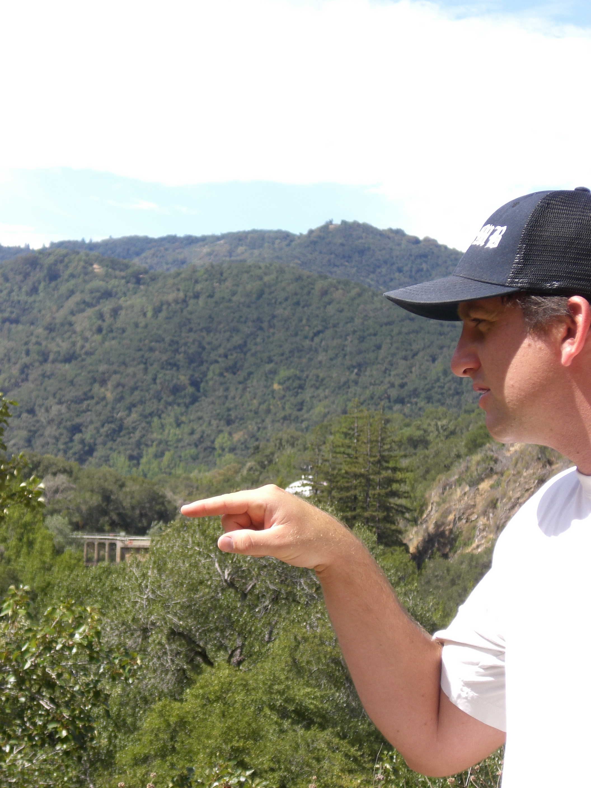

---
date:
  created: 2024-12-02
  updated: 2024-12-19
authors:
  - jmframe
---

# Hydrology is flat

"Very clever, Sir Edmond, but it is buckets all the way down!" Said no one, ever.  

For some reason, much of my recent work keeps coming back to buckets, and re-thinking the conceptualization of natural hydrologic systems as buckets. I am generally sick of talking about buckets. I'm hoping that this post is my farewell to thinking about buckets, at least for a while.

## Sir Edmond Leakybucket

When I was first learning differential equations the professor told us a silly story about Sir Edmond LeakingBucket, some ol' timey English royal who had to drink his ale quickly because his ale bucket leaked. I went on to study hydrology, so I've had to think about Sir Edmond for the past fiteen years. I can't escape him. Sometimes he mixes two kinds of ales together, sometimes his ale bucket is more complicated or simpler, but he is always losing his ale. Poor guy. Sir Edmond and his bucket do two important things: 1) gives nice differential equation examples, but more importantly for hydrology 2) Leaking buckets are a primary conceptualization for hydrologic processes. 

A simple differential equation for the ale level in Sir Edmond's bucket is:

$$
\frac{dh}{dt} = -k \sqrt{h}
$$

Where h(t) is the ale at time \( t \), k is a proportionality constant that governs the rate of outflow. Its solution through seperation of variables is:

$$
h(t) = \left(\sqrt{h_0} - \frac{k}{2}t\right)^2
$$

Where h_0 is the initial ale level in the bucket at time t = 0. This gives us the opportunity to track volumes of ale through this bucket, and match the fluxes from buckets with data collected on real-world hydrological systesm. This is, in a nutshell, the field of computational hydrology, we just need to dress up and add complications to this bucket, and off we go.  

<!-- more -->

## A walk through the watershed

Going back again to undergraduate, I was building my first watershed model (Frame, 2010). I spend weeks staring at a computer screen, writing code, processing data, and thinking through discretization of Sir Edmond's ale bucket. I went out to do some field work for a different project in the Carmel River Watershed, a valley I've been to a dozen times. But after spending so much time thinking about this watershed digitally, well really just a digital bucket representing the watershed, a sense of dred came over me as I looked down the Carmel Valley (Figured below). I was realizing how much my precious computer model was missing, seeing the errors in my assumptions, the variety of vegetation in areas my models represents as homogeneous, the property boundaries with drainage features. Nothing in the analog system seemed to match my digitization. There is overwhelming complexity in every watershed, river reach and hillslope, if our eyes are open.  

  

But in hydrology, we consider representing a delayed flow of water as a bucket a type of physical conceptualization. And as a matter of fact, this goes back a long way to Instantaneous Unit Hydrograph (IUH). In my MS level hydrology class, we learned that the IUH from linear reservoirs turns into a beta distribution (Nash 1960). This is a type of theoretical physical understanding of hydrology through buckets.  

The equation for the Instantaneous Unit Hydrograph (IUH) from linear reservoirs is:  

$$
q(t) = \frac{t^{n-1} e^{-t/k}}{k^n \Gamma(n)}
$$

Where q(t) is the flow rate at time \( t \), k is the storage coefficient (related to the delay in each reservoir), n is the number of reservoirs (controls the shape of the hydrograph), Gamma(n) is the gamma function.  

The physical Intuition is 1) the n reservoirs represent sequential storage compartments (or “buckets”) that delay and attenuate flow as water moves downstream, and 2) each bucket’s outflow becomes the inflow for the next, creating a cascade effect that smooths and delays the hydrograph. Hydrologists aren't the only ones to take simple conceptualizations and ask them to simulate complicated physical systems. This is similar to the use of harmonic oscillators in physics.  

## Harmonic oscillators
The ultraviolate catastrophy is the result of using harmonic oscillators as conceptual representations of physical systems in Classical Physics. The derevation of the Rayleigh-Jeans Radiation Law (see LibreTexts 2024) is based on these simple conceptual oscillators, but this leads to predicted energy densities that diverged at high frequencies, an issue experimentally inconsistent with observed data.  

*Image credit: HyperPhysics, ©1998-2020, Department of Physics and Astronomy, Georgia State University.*  

Max Planck resolved the ultraviolet catastrophe in 1900 by fundamentally rethinking the energy distribution, quantizing the energy, allowing the thermodynamic limit to match experimental data, giving evidence that energy in the real world is quantum, rather than continuous. Let's take note of a few important pieces of this success story. In the classical case, the energy was poorly concieved, assuming continuous energy distribution. Physicists knew this because the theory, when taken to the thermodynamic limit, didn't match observation data. This gap between theory and experiment ultimately inspired a revolutionary shift in conceptualization, paving the way for modern quantum mechanics, and improving our understanding of the natural world.  

## Taking buckets to their limit

The actual physical representation of a mathematical structure of a system of buckets flowing into each other is the correct physical model of one type of system only, and that is, of course, a system of buckets flowing into each other. Applying this model to a watershed, for instance, is similar to using continuous energy waves in the form of harmonic oscillators to model black body radiation. Yes, it will do in some cases, but we know it is not how the real world behaves.  

But let's take this idea of buckets flowing into each other a bit more seriously as a representation of hydrologic processes. When I am out on Carmel Valley Road overlooking the watershed, I see depressions, gullies, rills, blades of grass, everything else. All these individual processes do somewhat behave as oddly shaped buckets. A blad of grass, for instance, does collect moisture from the air, and that moisture does flow down the blade. A prarie pothole also fills up and overflows, bucket-like, yet some water flows down through the leaking bottom. Though these are not perfectly round reservoirs with known leaks with known coefficients, they do all sort of flow into each other. I used this idea to try to bring neural networks into hydrology from a more realistic conceptualization. With differentiable modeling (Shen et al., 2023), we can set up our neural network to behave like these systems of buckets, complete with valves on the spigots determining the flow coefficient (weights), and the water level dropping below the spigot shutting off flow completely (activation). What I think we are left with here is a pretty darn good digital interpretation of a messy, complex, heterogeneous system (image below from Frame et al., 2024).  

Each individual bucket in our nash cascade neural network behaves like a mass concerving perceptron (Wang et al., 2024). In this scenario, we end up with a model that has the uncanney ability to match a downstream diagnostic variable very well, and we have utilized the hydrologists tool of choice. But if we look closely, are we not simply re-creating a neural network?  

We've seen overwhelming evidence in the past few decades that neural networks are more accurate at predicting hydrologic responses than the conceptualization of hydrologic systems as buckets (Nearing et al., 2020). Unless that conceptualization itself can be boosted by a neural network (Shen et al., 2024). What I've always pondered is what would happen if hydrologists acted a bit more like physicists, and rejected demonstratively predictive conceptualizations in favor of those that match observations. There is often a sentiment that the bucket conceptualizations, even as simplifications, are "interpretable", but an interpretation is only usefull if we are honest about them limitations. We still learn the Rayleigh–Jeans law in thermodynamics, but we then understand the limitations of the continuous energy conceptualization and turn to Planck's Law to grasp the quantum reality. We can still learn bucket conceptualizations, but let's not pretend that they are "physical" representations.  

## Buckets as toy models, as an educational tool, and for hypothesis testing
One thing we can do with our digital buckets is use these simple concepts to explore complex ideas. Since we can easily generate synthetic data and test scenarios (Frame et al., 2023), we can study hydrological systems in a structured way. The Deep Bucket Lab models a ‘leaking bucket’ system to represent hydrological processes. Using synthetic data generated through numerical simulations, it demonstrates how factors like precipitation and bucket characteristics influence water flow dynamics. The lab employs a Long Short-Term Memory (LSTM) network to predict water levels and fluxes based on simulation data. Users can modify the model’s parameters and experiment with different scenarios to explore hydrological process representations and their predictability. Interactive graphs and experiments allow for practical engagement with the concepts. The lab provides a straightforward way to study hydrological systems and apply machine learning techniques to hydrology.  

But perhaps, developing educational material off of faulty conceptualizations further perpetuates the misconception, and we could do better by avoiding the analogy altogether. Instead, we might focus on directly engaging with the underlying physical principles and mathematical descriptions of hydrological systems. By prioritizing frameworks that capture the complexities of real-world processes, such as conservation laws and scale-dependent behaviors, we can provide learners with a more accurate and transferable understanding of hydrological dynamics. This approach encourages critical thinking and a deeper appreciation of the challenges in modeling complex environmental systems.

## Buckets all the way down
It has been a bit of a joke between me and my hydrology friends (shout out to the editorial board of this blog!) that everything just becomes a bucket, if you think about it long enough. There are a few analogies that we can use to represent many processes in the naturual world. Buckets and harmonic oscillators are just a two examples. They are ubiquitus with dynamic systems. They represent a convenient unit that we can manipulate and modify to study complex behaviors in an otherwise overwhelming system. When we boil systems down to these analogies we are playing around with ideas to help make us understand. We'll probably never know how the world actually works, we just don't have the sensory capabilities. Conceptualizations like buckets, oscillators, or reservoirs, help us bridge the gap between abstract mathematics and tangible phenomena. These models allow us to test theories, communicate ideas, and develop computational tools that extend our understanding of the natural world.

The real beauty lies in the interplay between abstraction and application. While we recognize the limitations of these analogies—no bucket, spring, or reservoir can capture the full complexity of a river basin or a turbulent atmosphere—they still provide an essential scaffold for exploration. From conceptual hydrological models to modern machine learning architectures, these analogies offer a common language to connect diverse fields of study, sparking innovation in ways that would be impossible without simplification.  

## References
Acuña Espinoza, E., Loritz, R., Álvarez Chaves, M., Bäuerle, N., and Ehret, U.: To bucket or not to bucket? Analyzing the performance and interpretability of hybrid hydrological models with dynamic parameterization, Hydrol. Earth Syst. Sci., 28, 2705–2719, https://doi.org/10.5194/hess-28-2705-2024, 2024. 

Frame, J. M. (2010). An integrated surface water-groundwater interaction model for the Carmel River.

Frame J. M., L. Hernandez Rodriguez, and M. Bassiouni (2023). "DeepBucketLab - A Playground for Understanding Deep Learning for Hydrologic Process Representations," DOI: 10.5072/zenodo.7349

Frame J. M., Bindas T., Araki R., Rapp J. and Deardorff E. (2024) Synchronization in hydrologic  processes and modeling the response with concepts, physics and neural networks. ESS Open Archive. DOI: 10.22541/essoar.171320241.14125931/v1

LibreTexts. (Retrieved 2024). Deriving the Rayleigh-Jeans Radiation Law. Retrieved from https://chem.libretexts.org/Bookshelves/

Nash, J. E., & HRS. (1960). A unit hydrograph study, with particular reference to British catchments. Proceedings of the Institution of Civil Engineers, 17(3), 249-282.

Nearing, G. S., Kratzert, F., Sampson, A. K., Pelissier, C. S., Klotz, D., Frame, J. M., Prieto, C., & Gupta, H. v. (2020). What Role Does Hydrological Science Play in the Age of Machine Learning? Water Resources Research. https://doi.org/10.1029/2020wr028091

Shen, C., Appling, A. P., Gentine, P., Bandai, T., Gupta, H., Tartakovsky, A., ... & Lawson, K. (2023). Differentiable modelling to unify machine learning and physical models for geosciences. Nature Reviews Earth & Environment, 4(8), 552-567.

Wang, Y. H., & Gupta, H. V. (2024). Towards interpretable physical‐conceptual catchment‐scale hydrological modeling using the mass‐conserving‐perceptron. Water Resources Research, 60(10), e2024WR037224.

